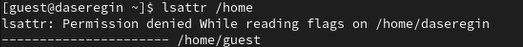

---
## Front matter
lang: ru-RU
title: Лабораторная работа № 2.
author:
  - Серегин Д.А.
institute:
  - Российский университет дружбы народов, Москва, Россия
date: 16 сентября 2023

## i18n babel
babel-lang: russian
babel-otherlangs: english

## Formatting pdf
toc: false
toc-title: Содержание
slide_level: 2
aspectratio: 169
theme: metropolis
section-titles: true
header-includes:
 - \metroset{progressbar=frametitle,sectionpage=progressbar,numbering=fraction}
 - '\makeatletter'
 - '\beamer@ignorenonframefalse'
 - '\makeatother'
---

## Цель работы

Получение практических навыков работы в консоли с атрибутами файлов, закрепление теоретических основ дискреционного разграничения доступа в современных системах с открытым кодом на базе ОС Linux

## Выполнение лабораторной работы

1. Создать пользователя guest. При помощи команды 

```
sudo useradd guest
```

2. Задать новому пользователю пароль, при помощи утилиты passwd.

```
sudo passwd guest
```

3. Войти в новую сессию под пользователем guest.

```
su guest
```

## Выполнение лабораторной работы

4. Открыть терминал и посмотреть в какой мы директории. Для этого будет использовать pwd (print workdir). Вывод команды можно увидеть на картинке (@fig:001). Данная директория является домашней для пользователя guest.

.png){#fig:001}

## Выполнение лабораторной работы

5. Для того, чтобы узнать username пользоваться, воспользуемся командой whoami (@fig:001).
6. Посмотрим на вывод команды id. Там мы видим UID, GID и дополнительные метки пользователя. Вывод информации о группах сопоставим (@fig:001) с тем, что мы увидем, при запуске команды groups.

7. Пользователь guest и в приглашение командной строки имеет в себе username guest.

## Выполнение лабораторной работы

7. В файле `/etc/passwd` лежит информация о всех пользователях системы (@fig:002).


.png){#fig:002}

## Выполнение лабораторной работы

9. В директории `/home` у нас находятся все папки для каждого пользователя системы. Посмотрим с помощью команды `ls -l /home ` (@fig:003) 

.png){#fig:003}

10. Можно посмотреть для домашней директории guest, но их нет. А для основного пользователя отказано в доступе. (@fig:004).

{#fig:004}

## Выполнение лабораторной работы

11. Создадим директорию `dir1` в домашнем каталоге. Посмотрим на ее права и атрибуты (@fig:005). На dir1 выставлены права 755.

{#fig:005}

12. Обнулим права доступа, при помощи chmod с аргументом 000.

     `chmod 000 dir1`

## Выполнение лабораторной работы

13. При попытке создать файл --- получаем ошибку доступа из-за отсутствия прав для кого-либо.

{#fig:006}

## Выполнение лабораторной работы

14. Далее заполним таблицы с правами доступа, но из-за их размера они не помещаются в презентацию


## Выводы

В ходе выполнения лабораторной работы я приобрел навыки работы с атрибутами файлов и директорий. 
