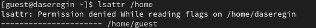
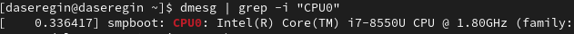
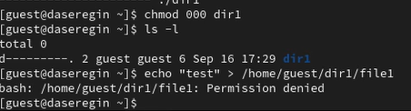

---
## Front matter
title: "Лабораторная работа № 2"
author: "Серегин Денис Алексеевич"

## Generic otions
lang: ru-RU
toc-title: "Содержание"

## Bibliography
bibliography: bib/cite.bib
csl: pandoc/csl/gost-r-7-0-5-2008-numeric.csl

## Pdf output format
toc: true # Table of contents
toc-depth: 2
lof: true # List of figures
lot: true # List of tables
fontsize: 12pt
linestretch: 1.5
papersize: a4
documentclass: scrreprt
## I18n polyglossia
polyglossia-lang:
  name: russian
  options:
	- spelling=modern
	- babelshorthands=true
polyglossia-otherlangs:
  name: english
## I18n babel
babel-lang: russian
babel-otherlangs: english
## Fonts
mainfont: PT Serif
romanfont: PT Serif
sansfont: PT Sans
monofont: PT Mono
mainfontoptions: Ligatures=TeX
romanfontoptions: Ligatures=TeX
sansfontoptions: Ligatures=TeX,Scale=MatchLowercase
monofontoptions: Scale=MatchLowercase,Scale=0.9
## Biblatex
biblatex: true
biblio-style: "gost-numeric"
biblatexoptions:
  - parentracker=true
  - backend=biber
  - hyperref=auto
  - language=auto
  - autolang=other*
  - citestyle=gost-numeric
## Pandoc-crossref LaTeX customization
figureTitle: "Рис."
tableTitle: "Таблица"
listingTitle: "Листинг"
lofTitle: "Список иллюстраций"
lotTitle: "Список таблиц"
lolTitle: "Листинги"
## Misc options
indent: true
header-includes:
  - \usepackage{indentfirst}
  - \usepackage{float} # keep figures where there are in the text
  - \floatplacement{figure}{H} # keep figures where there are in the text

---

# Цель работы

Получение практических навыков работы в консоли с атрибутами файлов, закрепление теоретических основ дискреционного разграничения доступа в современных системах с открытым кодом на базе ОС Linux

# Выполнение лабораторной работы

1. Создать пользователя guest. При помощи команды 

```
sudo useradd guest
```

2. Задать новому пользователю пароль, при помощи утилиты passwd.

```
sudo passwd guest
```

3. Войти в новую сессию под пользователем guest.

```
su guest
```

4. Открыть терминал и посмотреть в какой мы директории. Для этого будет использовать pwd (print workdir). Вывод команды можно увидеть на картинке (@fig:001). Данная директория является домашней для пользователя guest.

.png){#fig:001}

5. Для того, чтобы узнать username пользоваться, воспользуемся командой whoami (@fig:001).

6. Посмотрим на вывод команды id. Там мы видим UID, GID и дополнительные метки пользователя. Вывод информации о группах сопоставим (@fig:001) с тем, что мы увидем, при запуске команды groups.

7. Пользователь guest и в приглашение командной строки имеет в себе username guest.

8. В файле `/etc/passwd` лежит информация о всех пользователях системы (@fig:002).

.png){#fig:002}

9. В директории `/home` у нас находятся все папки для каждого пользователя системы. Посмотрим с помощью команды `ls -l /home ` (@fig:003) 

.png){#fig:003}

10. Можно посмотреть для домашней директории guest, но их нет. А для основного пользователя отказано в доступе. (@fig:004).

{#fig:004}

11. Создадим директорию `dir1` в домашнем каталоге. Посмотрим на ее права и атрибуты (@fig:005). На dir1 выставлены права 755.

{#fig:005}

12. Обнулим права доступа, при помощи chmod с аргументом 000.

     `chmod 000 dir1`

13. При попытке создать файл --- получаем ошибку доступа из-за отсутствия прав для кого-либо.

{#fig:006}

14. Заполним таблицу "Установленные права и разрешённые действия".

: Установленные права и разрешенные действия {#tbl:01}

|Права директории|Права файла|Создание файла|Удаление файла|Запись в файл|Чтение файла|Смена директории|Просмотр файлов директории|Переименование файла|Смена аттрибутов файла|
|------------------|-------------|-------|-----|------|-------|------------|-----------|---------|------------|
|```---------``` (000)|```---------``` (000)| - | - | - | - | - | - | - | - |
|```---------``` (000)|```--x------``` (100)| - | - | - | - | - | - | - | - |
|```---------``` (000)|```-w-------``` (200)| - | - | - | - | - | - | - | - |
|```---------``` (000)|```-wx------``` (300)| - | - | - | - | - | - | - | - |
|```---------``` (000)|```r--------``` (400)| - | - | - | - | - | - | - | - |
|```---------``` (000)|```r-x------``` (500)| - | - | - | - | - | - | - | - |
|```---------``` (000)|```rw-------``` (600)| - | - | - | - | - | - | - | - |
|```---------``` (000)|```rwx------``` (700)| - | - | - | - | - | - | - | - |
|```--x------``` (100)|```---------``` (000)| - | - | - | - | + | - | - | - |
|```--x------``` (100)|```--x------``` (100)| - | - | - | - | + | - | - | - |
|```--x------``` (100)|```-w-------``` (200)| - | - | + | - | + | - | - | - |
|```--x------``` (100)|```-wx------``` (300)| - | - | + | - | + | - | - | - |
|```--x------``` (100)|```r--------``` (400)| - | - | - | + | + | - | - | + |
|```--x------``` (100)|```r-x------``` (500)| - | - | - | + | + | - | - | + |
|```--x------``` (100)|```rw-------``` (600)| - | - | + | + | + | - | - | + |
|```--x------``` (100)|```rwx------``` (700)| - | - | + | + | + | - | - | + |
|```-w-------``` (200)|```---------``` (000)| - | - | - | - | - | - | - | - |
|```-w-------``` (200)|```--x------``` (100)| - | - | - | - | - | - | - | - |
|```-w-------``` (200)|```-w-------``` (200)| - | - | - | - | - | - | - | - |
|```-w-------``` (200)|```-wx------``` (300)| - | - | - | - | - | - | - | - |
|```-w-------``` (200)|```r--------``` (400)| - | - | - | - | - | - | - | - |
|```-w-------``` (200)|```r-x------``` (500)| - | - | - | - | - | - | - | - |
|```-w-------``` (200)|```rw-------``` (600)| - | - | - | - | - | - | - | - |
|```-w-------``` (200)|```rwx------``` (700)| - | - | - | - | - | - | - | - |
|```-wx------``` (300)|```---------``` (000)| + | + | - | - | + | - | + | - |
|```-wx------``` (300)|```--x------``` (100)| + | + | - | - | + | - | + | - |
|```-wx------``` (300)|```-w-------``` (200)| + | + | + | - | + | - | + | - |
|```-wx------``` (300)|```-wx------``` (300)| + | + | + | - | + | - | + | - |
|```-wx------``` (300)|```r--------``` (400)| + | + | - | + | + | - | + | + |
|```-wx------``` (300)|```r-x------``` (500)| + | + | - | + | + | - | + | + |
|```-wx------``` (300)|```rw-------``` (600)| + | + | + | + | + | - | + | + |
|```-wx------``` (300)|```rwx------``` (700)| + | + | + | + | + | - | + | + |
|```r--------``` (400)|```---------``` (000)| - | - | - | - | - | + | - | - |
|```r--------``` (400)|```--x------``` (100)| - | - | - | - | - | + | - | - |
|```r--------``` (400)|```-w-------``` (200)| - | - | - | - | - | + | - | - |
|```r--------``` (400)|```-wx------``` (300)| - | - | - | - | - | + | - | - |
|```r--------``` (400)|```r--------``` (400)| - | - | - | - | - | + | - | - |
|```r--------``` (400)|```r-x------``` (500)| - | - | - | - | - | + | - | - |
|```r--------``` (400)|```rw-------``` (600)| - | - | - | - | - | + | - | - |
|```r--------``` (400)|```rwx------``` (700)| - | - | - | - | - | + | - | - |
|```r-x------``` (500)|```---------``` (000)| - | - | - | - | + | + | - | - |
|```r-x------``` (500)|```--x------``` (100)| - | - | - | - | + | + | - | - |
|```r-x------``` (500)|```-w-------``` (200)| - | - | + | - | + | + | - | - |
|```r-x------``` (500)|```-wx------``` (300)| - | - | + | - | + | + | - | - |
|```r-x------``` (500)|```r--------``` (400)| - | - | - | + | + | + | - | + |
|```r-x------``` (500)|```r-x------``` (500)| - | - | - | + | + | + | - | + |
|```r-x------``` (500)|```rw-------``` (600)| - | - | + | + | + | + | - | + |
|```r-x------``` (500)|```rwx------``` (700)| - | - | + | + | + | + | - | + |
|```rw-------``` (600)|```---------``` (000)| - | - | - | - | - | + | - | - |
|```rw-------``` (600)|```--x------``` (100)| - | - | - | - | - | + | - | - |
|```rw-------``` (600)|```-w-------``` (200)| - | - | - | - | - | + | - | - |
|```rw-------``` (600)|```-wx------``` (300)| - | - | - | - | - | + | - | - |
|```rw-------``` (600)|```r--------``` (400)| - | - | - | - | - | + | - | - |
|```rw-------``` (600)|```r-x------``` (500)| - | - | - | - | - | + | - | - |
|```rw-------``` (600)|```rw-------``` (600)| - | - | - | - | - | + | - | - |
|```rw-------``` (600)|```rwx------``` (700)| - | - | - | - | - | + | - | - |
|```rwx------``` (700)|```---------``` (000)| + | + | - | - | + | + | + | - |
|```rwx------``` (700)|```--x------``` (100)| + | + | - | - | + | + | + | - |
|```rwx------``` (700)|```-w-------``` (200)| + | + | + | - | + | + | + | - |
|```rwx------``` (700)|```-wx------``` (300)| + | + | + | - | + | + | + | - |
|```rwx------``` (700)|```r--------``` (400)| + | + | - | + | + | + | + | + |
|```rwx------``` (700)|```r-x------``` (500)| + | + | - | + | + | + | + | + |
|```rwx------``` (700)|```rw-------``` (600)| + | + | + | + | + | + | + | + |
|```rwx------``` (700)|```rwx------``` (700)| + | + | + | + | + | + | + | + |

15. На основании заполненной таблицы определите те или иные минимально необходимые права для выполнения операций внутри директории dir1, заполните табл. 

: Минимальные права для совершения операций {#tbl:02}

|Операция                |Минимальные права на директорию|Минимальные права на файл|
|------------------------|-------------------------------|-------------------------|
|Создание файла          |d-wx------(300)                |----------(000)          |
|Удаление файла          |d-wx------(300)                |----------(000)          |
|Чтение файла            |d--x------(100)                |-r--------(400)          |
|Запись в файл           |d--x------(100)                |--w-------(200)          |
|Переименование файла    |d-wx------(300)                |----------(000)          |
|Создание поддиректории  |d-wx------(300)                |----------(000)          |
|Удаление поддиректории  |d-wx------(300)                |----------(000)          |


# Выводы

В ходе выполнения лабораторной работы я приобрел навыки работы с атрибутами файлов и директорий. 
