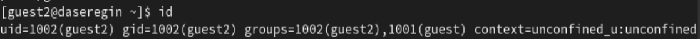
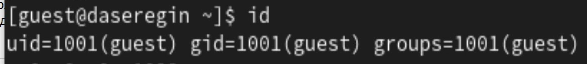
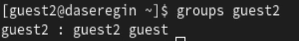
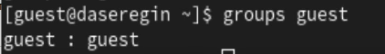
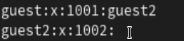
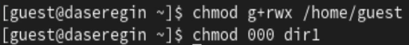

---
## Front matter
lang: ru-RU
title: Лабораторная работа № 3.
author:
  - Серегин Д.А.
institute:
  - Российский университет дружбы народов, Москва, Россия
date: 23 сентября 2023

## i18n babel
babel-lang: russian
babel-otherlangs: english

## Formatting pdf
toc: false
toc-title: Содержание
slide_level: 2
aspectratio: 169
theme: metropolis
section-titles: true
header-includes:
 - \metroset{progressbar=frametitle,sectionpage=progressbar,numbering=fraction}
 - '\makeatletter'
 - '\beamer@ignorenonframefalse'
 - '\makeatother'
---

## Цель работы

Получение практических навыков работы в консоли с атрибутами файлов для групп пользователей. 

## Выполнение лабораторной работы

1. Создадим пользователей guest и guest2, зададим им пароли. Выполнение лабораторной работы

.png){#fig:001}

## Выполнение лабораторной работы

2. Добавим пользователя guest2 в группу guest:

   .png){#fig:002}

3. Авторизуемся в двух разных консолях в пользователей guest и guest2 (@fig:003) (@fig:004):

.png){#fig:003}

{#fig:004}

## Выполнение лабораторной работы

4. Посмотрим индентификаторы групп и сравним значения из id и убедимся что они совпадают

{#fig:005}

{#fig:006}

## Выполнение лабораторной работы

{#fig:007}

{#fig:008}

## Выполнение лабораторной работы

5. Посмотрим содержимое файла /etc/group 

   {#fig:009}

## Выполнение лабораторной работы

6. Поменяем права для домашней директории пользователя guest а также для директории dir1{#fig:010}

## Выводы

В ходе выполнения лабораторной работы я получил практические навыки работы в консоли с атрибутами файлов для групп пользователей. 
