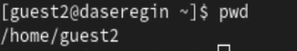
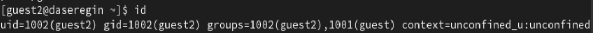
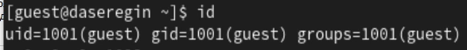
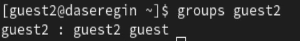
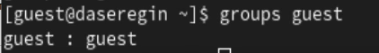
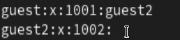
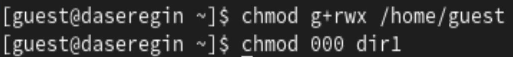

---
## Front matter
title: "Лабораторная работа № 3"
author: "Серегин Денис Алексеевич"

## Generic otions
lang: ru-RU
toc-title: "Содержание"

## Bibliography
bibliography: bib/cite.bib
csl: pandoc/csl/gost-r-7-0-5-2008-numeric.csl

## Pdf output format
toc: true # Table of contents
toc-depth: 2
lof: true # List of figures
lot: true # List of tables
fontsize: 12pt
linestretch: 1.5
papersize: a4
documentclass: scrreprt
## I18n polyglossia
polyglossia-lang:
  name: russian
  options:
	- spelling=modern
	- babelshorthands=true
polyglossia-otherlangs:
  name: english
## I18n babel
babel-lang: russian
babel-otherlangs: english
## Fonts
mainfont: PT Serif
romanfont: PT Serif
sansfont: PT Sans
monofont: PT Mono
mainfontoptions: Ligatures=TeX
romanfontoptions: Ligatures=TeX
sansfontoptions: Ligatures=TeX,Scale=MatchLowercase
monofontoptions: Scale=MatchLowercase,Scale=0.9
## Biblatex
biblatex: true
biblio-style: "gost-numeric"
biblatexoptions:
  - parentracker=true
  - backend=biber
  - hyperref=auto
  - language=auto
  - autolang=other*
  - citestyle=gost-numeric
## Pandoc-crossref LaTeX customization
figureTitle: "Рис."
tableTitle: "Таблица"
listingTitle: "Листинг"
lofTitle: "Список иллюстраций"
lotTitle: "Список таблиц"
lolTitle: "Листинги"
## Misc options
indent: true
header-includes:
  - \usepackage{indentfirst}
  - \usepackage{float} # keep figures where there are in the text
  - \floatplacement{figure}{H} # keep figures where there are in the text

---

# Цель работы

Получение практических навыков работы в консоли с атрибутами файлов для групп пользователей. 

# Выполнение лабораторной работы

1. Создадим пользователей guest и guest2, зададим им пароли. (@fig:001)

   .png){#fig:001}

2. Добавим пользователя guest2 в группу guest (@fig:002):

   .png){#fig:002}

3. Авторизуемся в двух разных консолях в пользователей guest и guest2 (@fig:003) (@fig:004):

.png){#fig:003}

{#fig:004}

4. Посмотрим индентификаторы групп (@fig:005)(@fig:006) и сравним значения из id (@fig:007)(@fig:008) и убедимся что они совпадают. 

{#fig:005}

{#fig:006}

{#fig:007}

{#fig:008}

5. Посмотрим содержимое файла /etc/group (@fig:009)

   {#fig:009}

6. Поменяем права для домашней директории пользователя guest а также для директории dir1{#fig:010}

   

7. Заполним таблицы с "Установленными правами и разрешённые действия".

: Установленные права и разрешенные действия {#tbl:01}

|Права директории|Права файла|Создание файла|Удаление файла|Запись в файл|Чтение файла|Смена директории|Просмотр файлов директории|Переименование файла|Смена аттрибутов файла|
|------------------|-------------|-------|-----|------|-------|------------|-----------|---------|------------|
|```---------``` (000)|```---------``` (000)| - | - | - | - | - | - | - | - |
|```---------``` (000)|```--x------``` (100)| - | - | - | - | - | - | - | - |
|```---------``` (000)|```-w-------``` (200)| - | - | - | - | - | - | - | - |
|```---------``` (000)|```-wx------``` (300)| - | - | - | - | - | - | - | - |
|```---------``` (000)|```r--------``` (400)| - | - | - | - | - | - | - | - |
|```---------``` (000)|```r-x------``` (500)| - | - | - | - | - | - | - | - |
|```---------``` (000)|```rw-------``` (600)| - | - | - | - | - | - | - | - |
|```---------``` (000)|```rwx------``` (700)| - | - | - | - | - | - | - | - |
|```--x------``` (100)|```---------``` (000)| - | - | - | - | + | - | - | - |
|```--x------``` (100)|```--x------``` (100)| - | - | - | - | + | - | - | - |
|```--x------``` (100)|```-w-------``` (200)| - | - | + | - | + | - | - | - |
|```--x------``` (100)|```-wx------``` (300)| - | - | + | - | + | - | - | - |
|```--x------``` (100)|```r--------``` (400)| - | - | - | + | + | - | - | + |
|```--x------``` (100)|```r-x------``` (500)| - | - | - | + | + | - | - | + |
|```--x------``` (100)|```rw-------``` (600)| - | - | + | + | + | - | - | + |
|```--x------``` (100)|```rwx------``` (700)| - | - | + | + | + | - | - | + |
|```-w-------``` (200)|```---------``` (000)| - | - | - | - | - | - | - | - |
|```-w-------``` (200)|```--x------``` (100)| - | - | - | - | - | - | - | - |
|```-w-------``` (200)|```-w-------``` (200)| - | - | - | - | - | - | - | - |
|```-w-------``` (200)|```-wx------``` (300)| - | - | - | - | - | - | - | - |
|```-w-------``` (200)|```r--------``` (400)| - | - | - | - | - | - | - | - |
|```-w-------``` (200)|```r-x------``` (500)| - | - | - | - | - | - | - | - |
|```-w-------``` (200)|```rw-------``` (600)| - | - | - | - | - | - | - | - |
|```-w-------``` (200)|```rwx------``` (700)| - | - | - | - | - | - | - | - |
|```-wx------``` (300)|```---------``` (000)| + | + | - | - | + | - | + | - |
|```-wx------``` (300)|```--x------``` (100)| + | + | - | - | + | - | + | - |
|```-wx------``` (300)|```-w-------``` (200)| + | + | + | - | + | - | + | - |
|```-wx------``` (300)|```-wx------``` (300)| + | + | + | - | + | - | + | - |
|```-wx------``` (300)|```r--------``` (400)| + | + | - | + | + | - | + | + |
|```-wx------``` (300)|```r-x------``` (500)| + | + | - | + | + | - | + | + |
|```-wx------``` (300)|```rw-------``` (600)| + | + | + | + | + | - | + | + |
|```-wx------``` (300)|```rwx------``` (700)| + | + | + | + | + | - | + | + |
|```r--------``` (400)|```---------``` (000)| - | - | - | - | - | + | - | - |
|```r--------``` (400)|```--x------``` (100)| - | - | - | - | - | + | - | - |
|```r--------``` (400)|```-w-------``` (200)| - | - | - | - | - | + | - | - |
|```r--------``` (400)|```-wx------``` (300)| - | - | - | - | - | + | - | - |
|```r--------``` (400)|```r--------``` (400)| - | - | - | - | - | + | - | - |
|```r--------``` (400)|```r-x------``` (500)| - | - | - | - | - | + | - | - |
|```r--------``` (400)|```rw-------``` (600)| - | - | - | - | - | + | - | - |
|```r--------``` (400)|```rwx------``` (700)| - | - | - | - | - | + | - | - |
|```r-x------``` (500)|```---------``` (000)| - | - | - | - | + | + | - | - |
|```r-x------``` (500)|```--x------``` (100)| - | - | - | - | + | + | - | - |
|```r-x------``` (500)|```-w-------``` (200)| - | - | + | - | + | + | - | - |
|```r-x------``` (500)|```-wx------``` (300)| - | - | + | - | + | + | - | - |
|```r-x------``` (500)|```r--------``` (400)| - | - | - | + | + | + | - | + |
|```r-x------``` (500)|```r-x------``` (500)| - | - | - | + | + | + | - | + |
|```r-x------``` (500)|```rw-------``` (600)| - | - | + | + | + | + | - | + |
|```r-x------``` (500)|```rwx------``` (700)| - | - | + | + | + | + | - | + |
|```rw-------``` (600)|```---------``` (000)| - | - | - | - | - | + | - | - |
|```rw-------``` (600)|```--x------``` (100)| - | - | - | - | - | + | - | - |
|```rw-------``` (600)|```-w-------``` (200)| - | - | - | - | - | + | - | - |
|```rw-------``` (600)|```-wx------``` (300)| - | - | - | - | - | + | - | - |
|```rw-------``` (600)|```r--------``` (400)| - | - | - | - | - | + | - | - |
|```rw-------``` (600)|```r-x------``` (500)| - | - | - | - | - | + | - | - |
|```rw-------``` (600)|```rw-------``` (600)| - | - | - | - | - | + | - | - |
|```rw-------``` (600)|```rwx------``` (700)| - | - | - | - | - | + | - | - |
|```rwx------``` (700)|```---------``` (000)| + | + | - | - | + | + | + | - |
|```rwx------``` (700)|```--x------``` (100)| + | + | - | - | + | + | + | - |
|```rwx------``` (700)|```-w-------``` (200)| + | + | + | - | + | + | + | - |
|```rwx------``` (700)|```-wx------``` (300)| + | + | + | - | + | + | + | - |
|```rwx------``` (700)|```r--------``` (400)| + | + | - | + | + | + | + | + |
|```rwx------``` (700)|```r-x------``` (500)| + | + | - | + | + | + | + | + |
|```rwx------``` (700)|```rw-------``` (600)| + | + | + | + | + | + | + | + |
|```rwx------``` (700)|```rwx------``` (700)| + | + | + | + | + | + | + | + |


: Минимальные права для совершения операций {#tbl:02}

| Операция               | Минимальные права на директорию | Минимальные права на файл |
| ---------------------- | ------------------------------- | ------------------------- |
| Создание файла         | 030                             | 000                       |
| Удаление файла         | 030                             | 000                       |
| Чтение файла           | 010                             | 040                       |
| Запись в файл          | 010                             | 020                       |
| Переименование файла   | 030                             | 000                       |
| Создание поддиректории | 030                             | 000                       |
| Удаление поддиректории | 030                             | 000                       |


# Выводы

В ходе выполнения лабораторной работы я получил практические навыки работы в консоли с атрибутами файлов для групп пользователей. 
