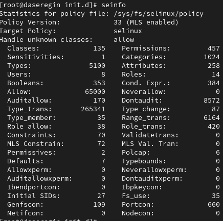
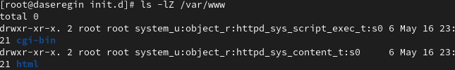
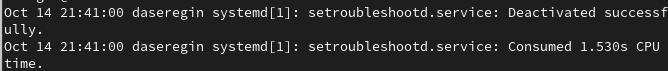

---
## Front matter
title: "Отчёт по лабораторной работе №6"
author: "Серегин Денис Алексеевич"

## Generic otions
lang: ru-RU
toc-title: "Содержание"

## Bibliography
bibliography: bib/cite.bib
csl: pandoc/csl/gost-r-7-0-5-2008-numeric.csl

## Pdf output format
toc: true # Table of contents
toc-depth: 2
lof: true # List of figures
lot: true # List of tables
fontsize: 12pt
linestretch: 1.5
papersize: a4
documentclass: scrreprt
## I18n polyglossia
polyglossia-lang:
  name: russian
  options:
	- spelling=modern
	- babelshorthands=true
polyglossia-otherlangs:
  name: english
## I18n babel
babel-lang: russian
babel-otherlangs: english
## Fonts
mainfont: PT Serif
romanfont: PT Serif
sansfont: PT Sans
monofont: PT Mono
mainfontoptions: Ligatures=TeX
romanfontoptions: Ligatures=TeX
sansfontoptions: Ligatures=TeX,Scale=MatchLowercase
monofontoptions: Scale=MatchLowercase,Scale=0.9
## Biblatex
biblatex: true
biblio-style: "gost-numeric"
biblatexoptions:
  - parentracker=true
  - backend=biber
  - hyperref=auto
  - language=auto
  - autolang=other*
  - citestyle=gost-numeric
## Pandoc-crossref LaTeX customization
figureTitle: "Рис."
tableTitle: "Таблица"
listingTitle: "Листинг"
lofTitle: "Список иллюстраций"
lotTitle: "Список таблиц"
lolTitle: "Листинги"
## Misc options
indent: true
header-includes:
  - \usepackage{indentfirst}
  - \usepackage{float} # keep figures where there are in the text
  - \floatplacement{figure}{H} # keep figures where there are in the text
---

# Цель работы

Развить навыки администрирования ОС Linux. Получить первое практическое знакомство с технологией SELinux. Проверить работу SELinx на практике совместно с веб-сервером Apache.

# Выполнение лабораторной работы

0. Перед выполнением лабораторной работы я подготовил виртуальную машину в соответствии с указаниями к лабораторной работе 

1. Вошел в систему с полученными учётными данными и убедился, что SELinux работает в режиме enforcing политики targeted. (рис. @fig:001)

   {#fig:001 width=70%}

2. Проверил работу веб-сервера с помощью браузера, убедившись, что он успешно работает. (рис. @fig:002)

   {#fig:002 width=70%}

3. Нашел процесс веб-сервера Apache в списке процессов. (рис. @fig:003)

   {#fig:003 width=70%}

4. Проверил текущее состояние переключателей SELinux для Apache с использованием команды `sestatus -bigrep httpd`. (рис. @fig:004)

   {#fig:004 width=70%}

5. Получил статистику по политике с помощью команды `seinfo` и определил множество пользователей, ролей и типов. (рис. @fig:005)

   {#fig:005 width=70%}

6. Определил тип файлов и поддиректорий в директории `/var/www` с помощью команды `ls -lZ /var/www`. (рис. @fig:006)

   {#fig:006 width=70%}

7. Определил тип файлов в директории `/var/www/html` с помощью команды `ls -lZ /var/www/html`. Как видим папка пуста. (рис. @fig:007)

   {#fig:007 width=70%}

8. Определил круг пользователей, которым разрешено создание файлов в директории `/var/www/html`. (рис. @fig:008)

   {#fig:008 width=70%}

9. Создал от имени суперпользователя файл `/var/www/html/test.html` с указанным содержанием. (рис. @fig:009)

   {#fig:009 width=70%}

10. Проверил контекст созданного файла, внес контекст, присваиваемый по умолчанию новым файлам в директории `/var/www/html` (рис. @fig:010)

    {#fig:010 width=70%}

11. Обратился к файлу через веб-сервер, введя в браузере соответствующий адрес, и убедился, что файл был успешно отображён. (рис. @fig:011)

    {#fig:011 width=70%}

12. Изучил справку `man httpd_selinux` и сопоставил контексты файлов для `httpd`. Проверил контекст файла с помощью команды `ls -Z /var/www/html/test.html`. (рис. @fig:012)

    {#fig:012 width=70%}

13. Изменил контекст файла `/var/www/html/test.html` на другой, к которому процессу httpd не должен иметь доступа, и проверил изменение контекста.

14. Попытался снова получить доступ к файлу через веб-сервер и убедился, что была выдана ошибка "Forbidden". (рис. @fig:013)

    {#fig:013 width=70%}

15. Проанализировал ситуацию и выяснил, что файл не был отображен, несмотря на права доступа, изучив логи веб-сервера и системные логи. (рис. @fig:014)

    {#fig:014 width=70%}

16. Попытался запустить веб-сервер Apache на прослушивание TCP-порта 81 и выяснил, что возник сбой. Так как порт не является стандартным. (рис. @fig:015)

    {#fig:015 width=70%}

17. Проанализировал логи и выяснил причину сбоя при попытке изменения порта прослушивания. (рис. @fig:016)

    {#fig:016 width=70%}

18. Проанализировал логи веб-сервера Apache и системные логи, определив, где появились новые записи.

19. Выполнил команду `semanage port -a -t http_port_t -p tcp 81` и убедился, что порт 81 добавлен. (рис. @fig:017)

    {#fig:017 width=70%}

20. Попытался снова запустить веб-сервер Apache и убедился, что он запустился успешно.

    Затем привёл всё к исходному состоянию следующими действиями:

21. Вернул контекст файла `/var/www/html/test.html` к исходному, предварительно изменив его на `samba_share_t`.

22. Изменил обратно конфигурационный файл Apache, вернув порт прослушивания к 80.

23. Удалил привязку http_port_t к порту 81.

24. Удалил файл `/var/www/html/test.html`.

# Выводы

В результате выполнения работы я развил свои навыки администрирования Linux, смог настроить SELinux, а также поработать с веб-сервисом Apache. 

